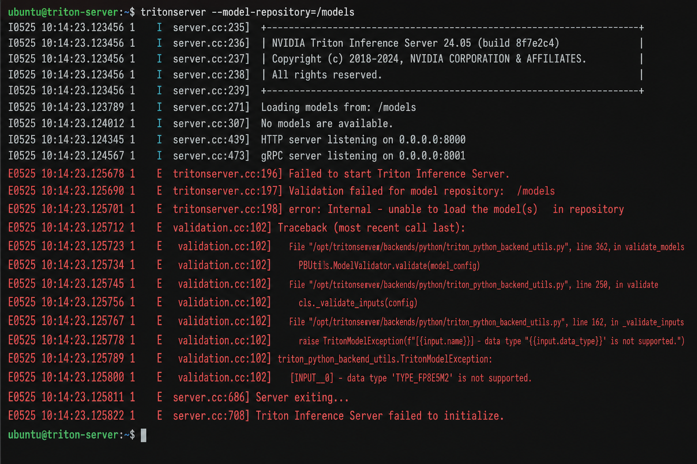
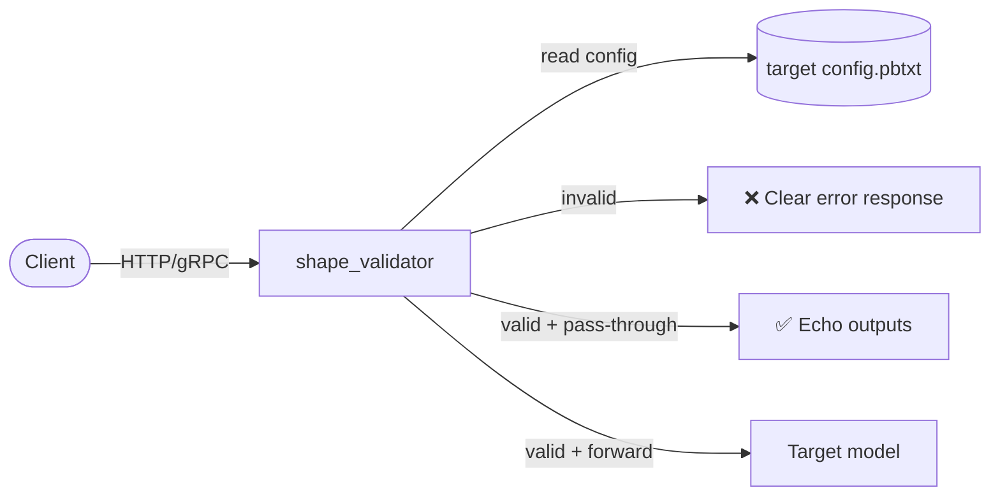

# Triton Shape Validator

**Python validation middleware for NVIDIA Triton Inference Server** — catch bad input tensors *before* they hit your production model.



---

## The Problem

Triton loads models from `config.pbtxt`, which declares the exact input tensor names, dtypes, and shapes each model expects. In production, bad requests still slip through:

- **Wrong shapes** — `(1, 1, 224, 224)` instead of `(1, 3, 224, 224)`
- **Wrong dtypes** — `INT32` instead of `FP32`
- **Missing or extra inputs** — client/model version drift

Without a guardrail, these requests either fail deep inside the model backend with opaque errors, or worse — produce silent garbage output. Debugging means tailing logs across services and guessing which client sent the bad tensor.

Triton's own shape checks only validate against the **middleware model's** `config.pbtxt`. They don't automatically cross-check against a **downstream model's** contract unless you wire that up yourself.

## The Solution

This project provides a **Python backend middleware** (`shape_validator`) that:

1. **Parses** a target model's `config.pbtxt` (via `tritonclient` + protobuf, with a stdlib fallback for Triton's minimal Python env)
2. **Validates** every inference request — names, dtypes, and shapes — against that config
3. **Rejects** invalid requests with a clear, actionable error message
4. **Optionally forwards** valid requests to the target model via [BLS](https://github.com/triton-inference-server/python_backend#business-logic-scripting)



### What gets validated

| Check | Example failure |
|-------|-----------------|
| Missing required input | `required input 'INPUT0' is missing` |
| Wrong dtype | `expected data_type TYPE_FP32, got TYPE_INT32` |
| Wrong shape | `dimension 1 expected 3, got 1` |
| Unknown input (strict mode) | `unexpected input(s) in request: FOO` |
| Variable dims (`-1`) | Any non-negative size accepted |

---

## Quick Start

### 1. Install dependencies

```bash
python3 -m venv .venv && source .venv/bin/activate
pip install -r requirements.txt
pip install 'tritonclient[http]'   # for the demo client
```

### 2. Run tests

```bash
PYTHONPATH=src python -m unittest discover -s tests -v
```

### 3. Start Triton

```bash
docker run --rm -p 8000:8000 -p 8001:8001 -p 8002:8002 \
  -v "$(pwd)/model_repository:/models" \
  nvcr.io/nvidia/tritonserver:24.05-py3 \
  tritonserver --model-repository=/models
```

> **Port already in use?** Stop leftover containers: `docker ps` → `docker stop <id>`

### 4. Verify health

```bash
curl -s -o /dev/null -w "HTTP %{http_code}\n" localhost:8000/v2/health/ready
# HTTP 200 (empty body = healthy)
```

### 5. Trigger a validation error

```bash
python scripts/demo_invalid_request.py
```

Expected output:

```
Input validation failed: [INPUT0] dimension 1 expected 3, got 1
```

---

## Project Layout

```
├── src/triton_validator/
│   ├── config_parser.py      # Parse config.pbtxt (protobuf + lite fallback)
│   ├── pbtxt_lite.py         # Stdlib parser for Triton's Python env
│   └── shape_validator.py    # Core validation logic
├── model_repository/
│   ├── shape_validator/      # Middleware Python backend
│   │   ├── config.pbtxt
│   │   └── 1/
│   │       ├── model.py
│   │       └── triton_validator/   # Bundled for Docker (no extra deps)
│   └── example_model/        # Demo target model
├── scripts/demo_invalid_request.py
├── tests/
└── docs/images/validation-error.png
```

---

## Configuration

Edit `model_repository/shape_validator/config.pbtxt`:

| Parameter | Description |
|-----------|-------------|
| `TARGET_MODEL` | Model whose `config.pbtxt` defines expected inputs (**required**) |
| `TARGET_MODEL_VERSION` | Version for BLS forwarding (optional) |
| `FORWARD_ON_SUCCESS` | `true` → proxy to target model after validation |
| `STRICT_INPUTS` | `true` → reject unknown input names (default) |

The middleware `input`/`output` blocks must align with your target model's tensor names. Set `dims` to match the target's non-batch dimensions (e.g. `[3, 224, 224]` with `max_batch_size > 0`).

After editing `src/triton_validator/`, sync into the bundled copy:

```bash
cp src/triton_validator/*.py model_repository/shape_validator/1/triton_validator/
```

---

## How It Works

### Config parsing

`config_parser.py` loads the target model's `config.pbtxt` using:

- **Primary:** `tritonclient.grpc.model_config_pb2` + `google.protobuf.text_format`
- **Fallback:** `pbtxt_lite.py` — stdlib-only parser used inside Triton's Python backend (which lacks `protobuf`)

Triton passes the model directory (not the repo root) as `model_repository`; the parser walks up to find `<repo>/<TARGET_MODEL>/config.pbtxt`.

### Validation

`shape_validator.py` builds a `ModelConfigSpec` from the parsed config and checks each request tensor:

```python
from triton_validator import load_model_config_from_pbtxt, validate_request_inputs

spec = load_model_config_from_pbtxt("model_repository/example_model/config.pbtxt")
validate_request_inputs(spec, {
    "INPUT0": {"shape": (1, 3, 224, 224), "data_type": "TYPE_FP32"},
})
```

### Middleware backend

`model.py` implements Triton's `TritonPythonModel` interface:

- **`initialize`** — loads target config from the model repository
- **`execute`** — validates each request; returns `TritonError` on failure
- **`finalize`** — cleanup hook

---

## Deployment Notes

- **No GPU required** for the validator itself — set `instance_group { kind: KIND_CPU }`.
- **Bundle dependencies** — the `triton_validator/` package is copied into `shape_validator/1/` so Docker doesn't need a `/src` mount or extra pip installs.
- **Ensemble pattern** — place `shape_validator` in front of your production model in a Triton ensemble for transparent validation.

---

## Troubleshooting

| Symptom | Fix |
|---------|-----|
| `No module named 'google'` | Use bundled `triton_validator/` in `shape_validator/1/` (includes lite parser) |
| `No model version was found` | Add a `1/` directory with a model file under the target model |
| `port is already allocated` | `docker stop $(docker ps -q --filter ancestor=nvcr.io/nvidia/tritonserver:24.05-py3)` |
| Health check shows empty output | Normal — Triton returns HTTP 200 with an empty body when ready |
| Triton rejects shape before middleware | Align `shape_validator` `input.dims` with target model (no extra `-1` dims) |

---

## License

MIT
